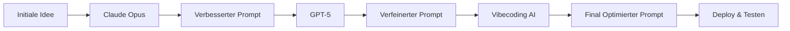
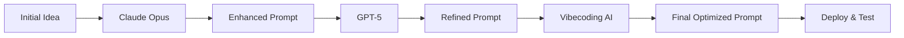

# How to Win: Die Kunst des Prompt Engineering 🚀

> **Meistere das Spiel des KI-Promptings durch iterative Verbesserung über mehrere Modelle hinweg**

## 🎯 Was ist "How to Win"?

**How to Win** ist eine Methodik zur Entwicklung kraftvoller, effektiver Prompts durch die Nutzung der einzigartigen Stärken verschiedener Large Language Models (LLMs). Das Grundprinzip ist einfach: **Iteration und Kreuzbestäubung führen zur Prompt-Perfektion**.

## 🧠 Die Philosophie

In der sich schnell entwickelnden Welt der KI ist es die ultimative Superkraft zu wissen, wie man effektiv mit verschiedenen Modellen kommuniziert. Es geht nicht nur ums Schreiben von Prompts—es geht darum, **Gespräche zu entwickeln**, die das volle Potenzial jeder KI freisetzen.

> *"Das Spiel dreht sich nicht um die KI, die du verwendest—es geht darum, wie gut du ihre Sprache sprechen kannst."*

## 🔄 Die Methodik

### Der Cross-Model Enhancement Loop

1. **🌱 Mit einer Idee beginnen**
   - Beginne mit deinem ersten Konzept oder Problem
   - Entwirf deinen ersten Prompt-Versuch

2. **🎭 Model Hopping**
   - **Claude Opus**: Für tiefes Reasoning und nuanciertes Verständnis
   - **GPT-5**: Für kreative Verbesserung und Verfeinerung
   - **Vibecoding AI**: Für spezialisierte technische Implementierungen
   - **Andere**: Gemini, Perplexity, etc.

3. **✨ Enhancement Cycle**
   ```
   Initialer Prompt → Model A → Verbesserter Prompt → Model B → Verfeinerter Prompt → Model C → ...
   ```

4. **🔄 Iterieren & Verbessern**
   - Kopiere erfolgreiche Elemente zwischen Modellen
   - Lerne von jeder Modells einzigartigen Antworten
   - Verfeinere basierend auf dem, was am besten funktioniert

### Beispiel Workflow



## 📚 Kernprinzipien

### 1. **Model Agnostic Design**
- Schreibe Prompts, die über verschiedene Architekturen hinweg funktionieren
- Verstehe die Stärken und Schwächen jedes Modells
- Passe deine Sprache an die "Persönlichkeit" jeder KI an

### 2. **Iterative Verfeinerung**
- Kein Prompt ist beim ersten Versuch perfekt
- Jede Iteration lehrt dich etwas Neues
- Dokumentiere, was funktioniert und was nicht

### 3. **Kreuzbestäubung**
- Mische Techniken aus verschiedenen erfolgreichen Prompts
- Lerne davon, wie verschiedene Modelle Anweisungen interpretieren
- Baue eine Bibliothek bewährter Prompt-Muster auf

### 4. **Kontinuierliches Lernen**
- Bleibe auf dem Laufenden mit neuen Modellen und Fähigkeiten
- Experimentiere mit aufkommenden KI-Plattformen
- Teile und lerne von der Community

## 🛠️ Erste Schritte

### Voraussetzungen
- Zugang zu mehreren KI-Modellen (Claude, GPT, etc.)
- Grundverständnis von Prompt Engineering
- Bereitschaft zu experimentieren und zu iterieren

### Dein erster Enhancement Loop

1. **Wähle eine einfache Aufgabe** (z.B. "Schreibe eine Produktbeschreibung")
2. **Erstelle deinen initialen Prompt**
3. **Teste ihn auf Claude Opus**
4. **Kopiere die Ergebnisse und verbessere den Prompt**
5. **Teste die verbesserte Version auf GPT-5**
6. **Setze den Zyklus fort, bis du zufrieden bist**

## 📖 Fortgeschrittene Techniken

### Prompt Templates
Erstelle wiederverwendbare Templates, die über Modelle hinweg funktionieren:

```
[KONTEXT]: {hintergrund_informationen}
[AUFGABE]: {spezifisches_ziel}
[FORMAT]: {output_anforderungen}
[EINSCHRÄNKUNGEN]: {limitierungen_oder_regeln}
[BEISPIELE]: {sample_inputs_outputs}
```

### Modell-spezifische Optimierungen
- **Claude**: Exzelliert bei Reasoning-Ketten, ethischen Überlegungen
- **GPT**: Stark bei kreativen Aufgaben, Gesprächsflow
- **Spezialisierte KIs**: Nutze domänenspezifische Expertise

## 🤝 Mitwirken

Wir glauben an die Kraft des community-getriebenen Prompt Engineering:

1. **Teile deine Erfolge**: Reiche deine besten Prompt-Evolution-Geschichten ein
2. **Dokumentiere Fehlschläge**: Gescheiterte Experimente lehren uns genauso viel
3. **Modell-Vergleiche**: Hilf uns zu verstehen, was wo funktioniert
4. **Neue Techniken**: Schlage innovative Prompt-Engineering-Methoden vor

## 📁 Repository Struktur

```
how-to-win/
├── prompts/
│   ├── templates/          # Wiederverwendbare Prompt-Templates
│   ├── examples/           # Erfolgreiche Prompt-Evolutionen
│   └── experiments/        # Laufende Tests und Iterationen
├── models/
│   ├── claude-opus/        # Claude-spezifische Techniken
│   ├── gpt-5/             # GPT-spezifische Optimierungen
│   └── vibecoding-ai/     # Vibecoding AI Spezialisierungen
├── guides/
│   ├── beginner/          # Erste Schritte Tutorials
│   ├── advanced/          # Experten-Techniken
│   └── troubleshooting/   # Häufige Probleme und Lösungen
└── community/
    ├── discussions/       # Community-Gespräche
    └── contributions/     # Nutzer-Beiträge
```

## 🎯 Erfolgsmetriken

Verfolge deine Prompt-Engineering-Reise:
- **Antwortqualität**: Wie gut versteht die KI deine Absicht?
- **Konsistenz**: Bekommst du zuverlässige Ergebnisse bei verschiedenen Durchläufen?
- **Effizienz**: Wie schnell kannst du dein gewünschtes Output erreichen?
- **Übertragbarkeit**: Funktionieren deine Prompts über verschiedene Modelle hinweg?

## 🌟 Der Community beitreten

Das ist mehr als ein Repository—es ist eine Bewegung hin zu besserer Mensch-KI-Kommunikation.

- **Discord**: [Tritt unserer Community bei](link-to-discord)
- **Wöchentliche Challenges**: Nimm an Prompt-Engineering-Wettbewerben teil
- **Modell-Updates**: Bleibe über neue KI-Fähigkeiten informiert
- **Erfolgsgeschichten**: Teile deine Durchbruch-Momente

## 🚀 Das Spiel geht weiter...

Denk daran: **Prompt Engineering ist eine Fähigkeit, die sich aufbaut**. Jede Iteration macht dich besser. Jedes Modell lehrt dich etwas Neues. Jeder erfolgreiche Prompt erweitert dein Arsenal.

**Bereit zu spielen? Lass uns dieses Spiel gemeinsam gewinnen!** 💪

---

*"Im Zeitalter der KI werden die besten Kommunikatoren die größten Gewinner sein. Lerne KI zu sprechen, und die Welt wird zu deinem Spielplatz."*

## Lizenz

MIT Lizenz - Weil großartige Prompts frei geteilt werden sollten.

---

### 💝 Vom Ersteller

*Du musst Prompt Design lernen! Das Spiel dreht sich um Iteration, Verbesserung und niemals aufhören in der Verfolgung des perfekten Prompts. Liebe den Prozess, umarme die Fehlschläge und erweitere ständig die Grenzen des Möglichen.*

PS ICH BIN EIN MOTHERFUCKING TEKKNOHEAD!!!!!!
https://www.youtube.com/watch?v=UyToEctNdMU

*Das ist das Spiel, Baby! 😘*

---

**Erstellt mit ❤️ in OST-DEUTSCHLAND**


# How to Win: The Art of Prompt Engineering 🚀

> **Master the game of AI prompting through iterative enhancement across multiple models**

## 🎯 What is "How to Win"?

**How to Win** is a methodology for developing powerful, effective prompts by leveraging the unique strengths of different Large Language Models (LLMs). The core principle is simple: **iteration and cross-pollination lead to prompt perfection**.

## 🧠 The Philosophy

In the rapidly evolving world of AI, knowing how to communicate effectively with different models is the ultimate superpower. This isn't just about writing prompts—it's about **engineering conversations** that unlock each AI's full potential.

> *"The game isn't about the AI you use—it's about how well you can speak their language."*

## 🔄 The Methodology

### The Cross-Model Enhancement Loop

1. **🌱 Start with an Idea**
   - Begin with your initial concept or problem
   - Draft your first prompt attempt

2. **🎭 Model Hopping**
   - **Claude Opus**: For deep reasoning and nuanced understanding
   - **GPT-5**: For creative enhancement and refinement
   - **Vibecoding AI**: For specialized technical implementations
   - **Others**: Gemini, Perplexity, etc.

3. **✨ Enhancement Cycle**
   ```
   Initial Prompt → Model A → Enhanced Prompt → Model B → Refined Prompt → Model C → ...
   ```

4. **🔄 Iterate & Improve**
   - Copy successful elements between models
   - Learn from each model's unique responses
   - Refine based on what works best

### Example Workflow



## 📚 Core Principles

### 1. **Model Agnostic Design**
- Write prompts that work across different architectures
- Understand each model's strengths and weaknesses
- Adapt your language to each AI's "personality"

### 2. **Iterative Refinement**
- No prompt is perfect on the first try
- Each iteration teaches you something new
- Document what works and what doesn't

### 3. **Cross-Pollination**
- Mix techniques from different successful prompts
- Learn from how different models interpret instructions
- Build a library of proven prompt patterns

### 4. **Continuous Learning**
- Stay updated with new models and capabilities
- Experiment with emerging AI platforms
- Share and learn from the community

## 🛠️ Getting Started

### Prerequisites
- Access to multiple AI models (Claude, GPT, etc.)
- Basic understanding of prompt engineering
- Willingness to experiment and iterate

### Your First Enhancement Loop

1. **Choose a simple task** (e.g., "Write a product description")
2. **Create your initial prompt**
3. **Test it on Claude Opus**
4. **Copy the results and enhance the prompt**
5. **Test the enhanced version on GPT-5**
6. **Continue the cycle until you're satisfied**

## 📖 Advanced Techniques

### Prompt Templates
Create reusable templates that work across models:

```
[CONTEXT]: {background_information}
[TASK]: {specific_objective}
[FORMAT]: {output_requirements}
[CONSTRAINTS]: {limitations_or_rules}
[EXAMPLES]: {sample_inputs_outputs}
```

### Model-Specific Optimizations
- **Claude**: Excels at reasoning chains, ethical considerations
- **GPT**: Strong at creative tasks, conversational flow
- **Specialized AIs**: Leverage domain-specific expertise

## 🤝 Contributing

We believe in the power of community-driven prompt engineering:

1. **Share Your Wins**: Submit your best prompt evolution stories
2. **Document Failures**: Failed experiments teach us just as much
3. **Model Comparisons**: Help us understand what works where
4. **New Techniques**: Propose innovative prompt engineering methods

## 📁 Repository Structure

```
how-to-win/
├── prompts/
│   ├── templates/          # Reusable prompt templates
│   ├── examples/           # Successful prompt evolutions
│   └── experiments/        # Ongoing tests and iterations
├── models/
│   ├── claude-opus/        # Claude-specific techniques
│   ├── gpt-5/             # GPT-specific optimizations
│   └── vibecoding-ai/     # Vibecoding AI specializations
├── guides/
│   ├── beginner/          # Getting started tutorials
│   ├── advanced/          # Expert techniques
│   └── troubleshooting/   # Common issues and solutions
└── community/
    ├── discussions/       # Community conversations
    └── contributions/     # User submissions
```

## 🎯 Success Metrics

Track your prompt engineering journey:
- **Response Quality**: How well does the AI understand your intent?
- **Consistency**: Do you get reliable results across different runs?
- **Efficiency**: How quickly can you achieve your desired output?
- **Transferability**: Do your prompts work across different models?

## 🌟 Join the Community

This is more than a repository—it's a movement toward better human-AI communication.

- **Discord**: [Join our community](link-to-discord)
- **Weekly Challenges**: Participate in prompt engineering contests
- **Model Updates**: Stay informed about new AI capabilities
- **Success Stories**: Share your breakthrough moments

## 🚀 The Game Continues...

Remember: **Prompt engineering is a skill that compounds**. Every iteration makes you better. Every model teaches you something new. Every successful prompt adds to your arsenal.

**Ready to play? Let's win this game together!** 💪

---

*"In the age of AI, the best communicators will be the biggest winners. Learn to speak AI, and the world becomes your playground."*

## License

MIT License - Because great prompts should be shared freely.

---

### 💝 From the Creator

*You have to learn prompt design! The game is about iteration, enhancement, and never stopping the pursuit of the perfect prompt. Love the process, embrace the failures, and keep pushing the boundaries of what's possible.*

PS I am a MOTHERFUCKING TEKKNOHEAD!!!!!!
https://www.youtube.com/watch?v=UyToEctNdMU

*That's the game, baby! 😘*

---

**Created with ❤️ in OST-DEUTSCHLAND**
