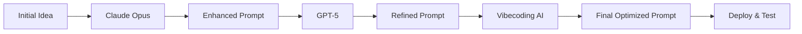

# How to Win: The Art of Prompt Engineering 🚀

> **Master the game of AI prompting through iterative enhancement across multiple models**

## 🎯 What is "How to Win"?

**How to Win** is a methodology for developing powerful, effective prompts by leveraging the unique strengths of different Large Language Models (LLMs). The core principle is simple: **iteration and cross-pollination lead to prompt perfection**.

## 🧠 The Philosophy

In the rapidly evolving world of AI, knowing how to communicate effectively with different models is the ultimate superpower. This isn't just about writing prompts—it's about **engineering conversations** that unlock each AI's full potential.

> *"The game isn't about the AI you use—it's about how well you can speak their language."*

## 🔄 The Methodology

### The Cross-Model Enhancement Loop

1. **🌱 Start with an Idea**
   - Begin with your initial concept or problem
   - Draft your first prompt attempt

2. **🎭 Model Hopping**
   - **Claude Opus**: For deep reasoning and nuanced understanding
   - **GPT-5**: For creative enhancement and refinement
   - **Vibecoding AI**: For specialized technical implementations
   - **Others**: Gemini, Perplexity, etc.

3. **✨ Enhancement Cycle**
   ```
   Initial Prompt → Model A → Enhanced Prompt → Model B → Refined Prompt → Model C → ...
   ```

4. **🔄 Iterate & Improve**
   - Copy successful elements between models
   - Learn from each model's unique responses
   - Refine based on what works best

### Example Workflow



## 📚 Core Principles

### 1. **Model Agnostic Design**
- Write prompts that work across different architectures
- Understand each model's strengths and weaknesses
- Adapt your language to each AI's "personality"

### 2. **Iterative Refinement**
- No prompt is perfect on the first try
- Each iteration teaches you something new
- Document what works and what doesn't

### 3. **Cross-Pollination**
- Mix techniques from different successful prompts
- Learn from how different models interpret instructions
- Build a library of proven prompt patterns

### 4. **Continuous Learning**
- Stay updated with new models and capabilities
- Experiment with emerging AI platforms
- Share and learn from the community

## 🛠️ Getting Started

### Prerequisites
- Access to multiple AI models (Claude, GPT, etc.)
- Basic understanding of prompt engineering
- Willingness to experiment and iterate

### Your First Enhancement Loop

1. **Choose a simple task** (e.g., "Write a product description")
2. **Create your initial prompt**
3. **Test it on Claude Opus**
4. **Copy the results and enhance the prompt**
5. **Test the enhanced version on GPT-5**
6. **Continue the cycle until you're satisfied**

## 📖 Advanced Techniques

### Prompt Templates
Create reusable templates that work across models:

```
[CONTEXT]: {background_information}
[TASK]: {specific_objective}
[FORMAT]: {output_requirements}
[CONSTRAINTS]: {limitations_or_rules}
[EXAMPLES]: {sample_inputs_outputs}
```

### Model-Specific Optimizations
- **Claude**: Excels at reasoning chains, ethical considerations
- **GPT**: Strong at creative tasks, conversational flow
- **Specialized AIs**: Leverage domain-specific expertise

## 🤝 Contributing

We believe in the power of community-driven prompt engineering:

1. **Share Your Wins**: Submit your best prompt evolution stories
2. **Document Failures**: Failed experiments teach us just as much
3. **Model Comparisons**: Help us understand what works where
4. **New Techniques**: Propose innovative prompt engineering methods

## 📁 Repository Structure

```
how-to-win/
├── prompts/
│   ├── templates/          # Reusable prompt templates
│   ├── examples/           # Successful prompt evolutions
│   └── experiments/        # Ongoing tests and iterations
├── models/
│   ├── claude-opus/        # Claude-specific techniques
│   ├── gpt-5/             # GPT-specific optimizations
│   └── vibecoding-ai/     # Vibecoding AI specializations
├── guides/
│   ├── beginner/          # Getting started tutorials
│   ├── advanced/          # Expert techniques
│   └── troubleshooting/   # Common issues and solutions
└── community/
    ├── discussions/       # Community conversations
    └── contributions/     # User submissions
```

## 🎯 Success Metrics

Track your prompt engineering journey:
- **Response Quality**: How well does the AI understand your intent?
- **Consistency**: Do you get reliable results across different runs?
- **Efficiency**: How quickly can you achieve your desired output?
- **Transferability**: Do your prompts work across different models?

## 🌟 Join the Community

This is more than a repository—it's a movement toward better human-AI communication.

- **Discord**: [Join our community](link-to-discord)
- **Weekly Challenges**: Participate in prompt engineering contests
- **Model Updates**: Stay informed about new AI capabilities
- **Success Stories**: Share your breakthrough moments

## 🚀 The Game Continues...

Remember: **Prompt engineering is a skill that compounds**. Every iteration makes you better. Every model teaches you something new. Every successful prompt adds to your arsenal.

**Ready to play? Let's win this game together!** 💪

---

*"In the age of AI, the best communicators will be the biggest winners. Learn to speak AI, and the world becomes your playground."*

## License

MIT License - Because great prompts should be shared freely.

---

### 💝 From the Creator

*You have to learn prompt design! The game is about iteration, enhancement, and never stopping the pursuit of the perfect prompt. Love the process, embrace the failures, and keep pushing the boundaries of what's possible.*

*That's the game, baby! 😘*
